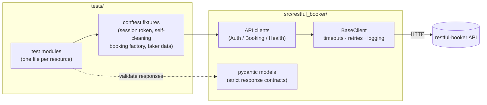

# restful-booker API Test Framework

[](https://github.com/qasimmahmood95/python-api-automation/actions/workflows/ci.yml)

[](https://github.com/astral-sh/ruff)
[](https://mypy-lang.org/)

A production-grade API test automation framework for the
[restful-booker](https://restful-booker.herokuapp.com) hotel-booking API, built with
**pytest**, **requests**, and **pydantic**. Tests validate the full HTTP contract —
status codes *and* response schemas — through a typed client layer, with self-cleaning
test data and a CI pipeline that gates every change deterministically.

## Architecture



- **Clients** (`src/restful_booker/clients/`) — one class per API resource, one method
  per endpoint. They return raw `requests.Response` objects and never assert, so every
  assertion lives in the test that owns the behavior.
- **Models** (`src/restful_booker/models.py`) — pydantic contracts with
  `extra="forbid"`: any field the API adds, renames, or drops fails loudly.
- **Fixtures** (`tests/conftest.py`) — a session-scoped auth token (one auth call per
  run), and a booking factory that deletes everything it created during teardown, so
  the suite leaves no residue even on the shared public instance.

## Project layout

```
├── src/restful_booker/
│   ├── clients/            # BaseClient + Auth/Booking/Health clients
│   └── models.py           # strict pydantic response contracts
├── tests/
│   ├── conftest.py         # fixtures: clients, auth token, booking factory
│   ├── data/invalid/       # malformed payloads (the malformation is the point)
│   ├── test_ping.py        # health check
│   ├── test_auth.py        # token issuance
│   ├── test_booking_crud.py
│   └── test_booking_validation.py
├── .github/workflows/ci.yml
├── docker-compose.yml      # hermetic run: API container + test container
├── docs/TEST_STRATEGY.md
└── pyproject.toml          # single home for packaging, pytest, ruff, mypy config
```

## Getting started

```bash
make install        # venv + pip install -e ".[dev]" + pre-commit hooks
make test           # full suite against the live public API
make smoke          # just the smoke-marked tests
make lint typecheck # ruff + strict mypy
make report         # suite + self-contained HTML report in reports/
```

Prefer a fully hermetic run (no dependence on Heroku availability)? With Docker
installed:

```bash
make docker-test    # spins up restful-booker + runs the suite against it
```

Any target can be pointed elsewhere:

```bash
pytest --base-url http://localhost:3001
```

Demo credentials (`admin` / `password123`) are restful-booker's published
documentation values — configuration, not secrets. Override with
`BOOKER_USERNAME` / `BOOKER_PASSWORD` env vars.

## CI pipeline

| Job | Trigger | What it does |
|---|---|---|
| `lint` | every push / PR | ruff check, ruff format, strict mypy |
| `test` | every push / PR | suite on Python 3.11–3.13 against a **pinned restful-booker container** (deterministic — no shared state, no cold starts), parallelized with `pytest-xdist`; HTML report uploaded per run |
| `live-nightly` | nightly cron / manual | full suite against the live Heroku instance with bounded reruns; report always uploaded |

Red PR builds mean real regressions: retries are deliberately **not** enabled in the
PR-gating job. See the [flakiness policy](docs/TEST_STRATEGY.md#5-flakiness-policy).

## Design decisions

- **Client layer instead of raw `requests` in tests.** Tests read as *intent*
  (`booking_client.create_booking(payload)`), while timeouts, retries, and logging live
  in one place. Every request carries a timeout, so a stalled endpoint fails fast
  instead of hanging a CI runner.
- **Connection-only retries.** The retry adapter never retries on HTTP status codes:
  tests assert on 4xx/5xx responses, and a non-idempotent `POST` must never be silently
  replayed after its body was sent.
- **Strict schema validation.** Spot-checking one field lets contract drift through;
  `extra="forbid"` models validate the entire response shape on every call.
- **Self-cleaning, order-independent tests.** Each test creates its own booking through
  a factory fixture that guarantees deletion on teardown — no test depends on another's
  leftovers, which is what makes `pytest-xdist` parallelism safe.
- **Dynamic test data.** Booking payloads are faker-generated per test (and logged for
  reproducibility); static JSON is reserved for invalid-shape payloads where the exact
  malformation is the test case.

### Intentional API quirks

restful-booker deliberately misbehaves in documented ways. The suite asserts the
*actual* contract, with a comment at each assertion site:

| Behavior | Conventional | Actual (asserted) |
|---|---|---|
| `GET /ping` | 200 | **201 Created** |
| `POST /auth`, bad credentials | 401 | **200** + `{"reason": "Bad credentials"}` |
| `POST /booking`, invalid payload | 400 | **500 Internal Server Error** |
| `DELETE /booking/{id}` success | 200/204 | **201 Created** |

## Documentation

- [Test strategy](docs/TEST_STRATEGY.md) — scope, risk-based approach, flakiness
  policy, what is deliberately not automated.
- [Improvement plan](docs/IMPROVEMENT_PLAN.md) — the roadmap this framework was built
  against (all phases implemented).
